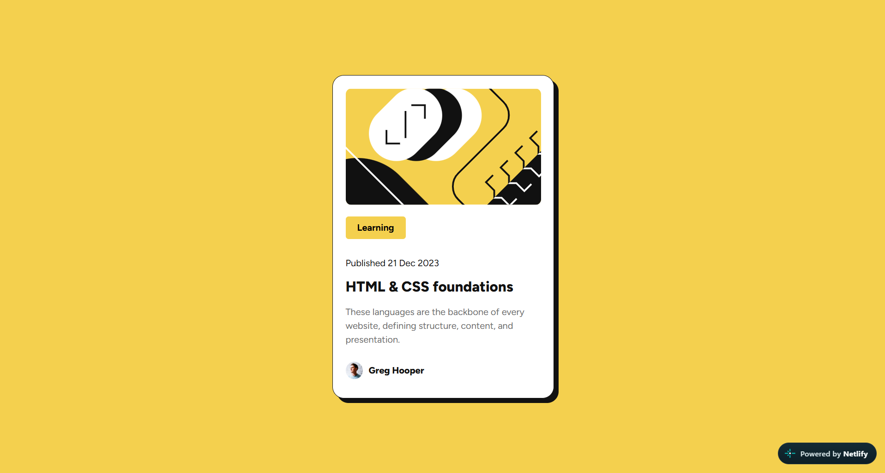

# Frontend Mentor - Blog Preview Card

This is my solution to the **Blog Preview Card** challenge from Frontend Mentor. The goal was to recreate the provided design as closely as possible while making the card responsive across different screen sizes.

## Preview

## Built With

* HTML5
* CSS3
* Flexbox
* Responsive Design
* Custom fonts using `@font-face`

## Features

* Responsive layout for desktop and mobile screens
* Custom Figtree font
* Styled blog card with border and shadow
* Responsive image and content sizing
* Typography and spacing matched to the provided design

## What I Learned

Through this project, I practiced building a layout from a static design, using Flexbox for positioning, creating responsive card dimensions, loading local fonts with `@font-face`, and adjusting typography and spacing to match a reference design.

## Links

* Live Site: [View Live Site](https://blog-preview-card-mentors.netlify.app/)
* Repository: [GitHub](https://github.com/Neharajendran-04/blog-preview-card)

